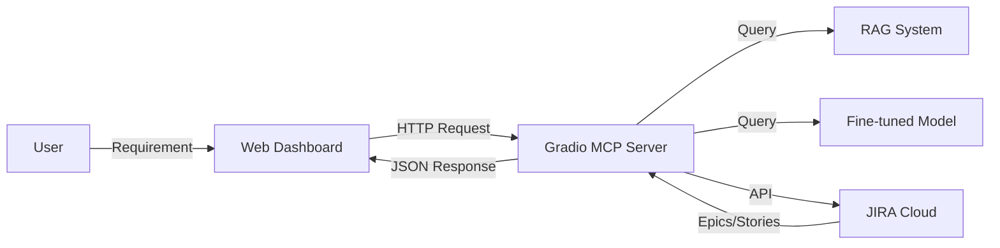

# 🤖 AI Development Agent

A comprehensive AI-powered software development agent that automates the workflow from requirement analysis to JIRA task creation, leveraging RAG (Retrieval Augmented Generation), Fine-tuned Models, and MCP (Model Context Protocol).

## 🌟 Overview

This project implements an intelligent agent capable of:
1. **Analyzing Requirements**: Understanding user inputs for new software features.
2. **Generating Specifications**: Using RAG to retrieve relevant context and generate detailed product specs.
3. **Providing Domain Insights**: Consulting fine-tuned models for industry-specific compliance and best practices.
4. **Managing JIRA Workflows**: Automatically searching for existing epics, creating new ones, and breaking them down into user stories.
5. **Visual Dashboard**: A modern web interface to track the entire process in real-time.

## 🏗️ Architecture

The system consists of two main components:

### 1. Dashboard (Frontend & Backend)
- **Tech Stack**: FastAPI, WebSocket, Vanilla JS, CSS Glassmorphism
- **Role**: User interface, workflow orchestration, real-time logs
- **Port**: 8000

### 2. MCP Server (Integration Hub)
- **Tech Stack**: Gradio, Python, JIRA API, ChromaDB (ready)
- **Role**: Centralized API for RAG, Fine-tuning, and JIRA operations
- **Port**: 7860



## ✨ Key Features

- **🧠 Intelligent RAG**: Retrieves context from documentation to generate accurate specs.
- **🎯 Domain Expertise**: Fine-tuned models provide specific insights (Insurance, Finance, etc.).
- **🔄 Smart JIRA Integration**:
  - **Deduplication**: Checks for existing epics before creating new ones.
  - **Auto-Hierarchy**: Creates Epics and automatically adds User Stories.
  - **ADF Support**: Handles Atlassian Document Format for rich text descriptions.
- **⚡ Real-time Feedback**: WebSocket-based dashboard updates.

## 🚀 Quick Start

### Prerequisites
- Python 3.10+ (Recommended: 3.11 or 3.12 due to Gradio/Python 3.13 compatibility)
- JIRA Account (for real integration)

### Installation

1. **Clone the repository**
   ```bash
   git clone <repo-url>
   cd mcp-hack
   ```

2. **Setup MCP Server**
   ```bash
   cd mcp
   python3 -m venv venv
   source venv/bin/activate
   pip install -r requirements.txt
   
   # Fix for Python 3.13 if needed
   pip install audioop-lts
   ```

3. **Setup Dashboard**
   ```bash
   cd ../dashboard
   python3 -m venv venv
   source venv/bin/activate
   pip install -r requirements.txt
   ```

### Configuration

Create a `.env` file in `mcp/` with your credentials:

```env
# JIRA Configuration
JIRA_URL="https://your-domain.atlassian.net"
JIRA_EMAIL="your-email@example.com"
JIRA_API_TOKEN="your-api-token"
JIRA_PROJECT_KEY="PROJ"

# RAG & Fine-tuning
RAG_ENABLED="true"
VECTOR_DB_PATH="./data/vectordb"
FINETUNED_MODEL_PATH="./models/insurance-model"
```

### Running the System

**Terminal 1: MCP Server**
```bash
cd mcp
source venv/bin/activate
python mcp_server.py
```

**Terminal 2: Dashboard**
```bash
cd dashboard
source venv/bin/activate
python server.py
```

Access the dashboard at **http://localhost:8000**

## 📂 Project Structure

```
/
├── dashboard/                 # Web Interface
│   ├── server.py              # FastAPI Backend
│   ├── app.js                 # Frontend Logic
│   ├── index.html             # UI Structure
│   └── style.css              # Styling
│
├── mcp/                       # Integration Server
│   ├── mcp_server.py          # Gradio Server
│   ├── requirements.txt       # Dependencies
│   └── .env.example           # Config Template
│
├── finetune/                  # Fine-tuning Guides
│   ├── 01-data-preparation.md
│   └── ...
│
└── docs/                      # Documentation
    └── agentdesign.md         # System Design
```

## 🤝 Contributing

Contributions are welcome! Please read our contributing guidelines and submit pull requests to the `main` branch.

## 📝 License

MIT License
