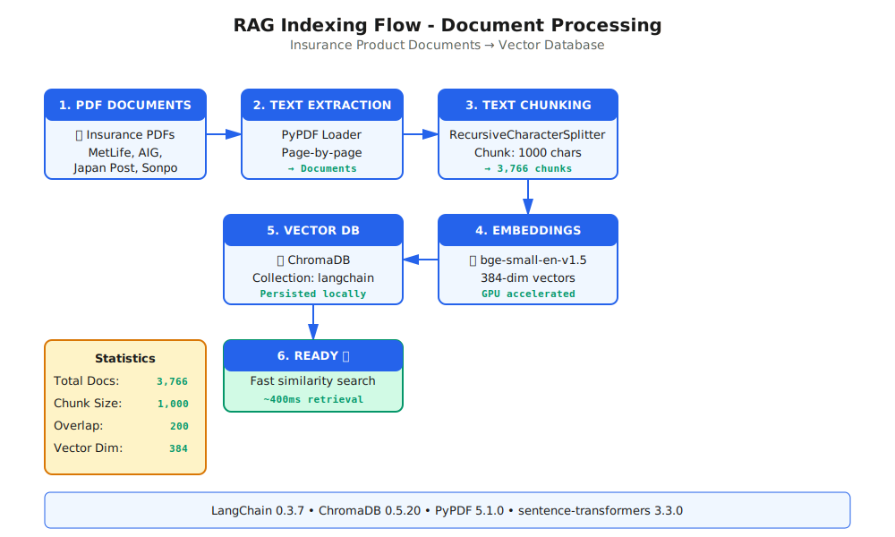
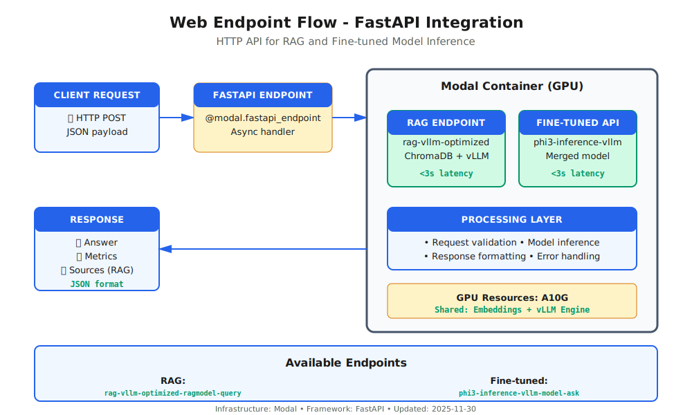
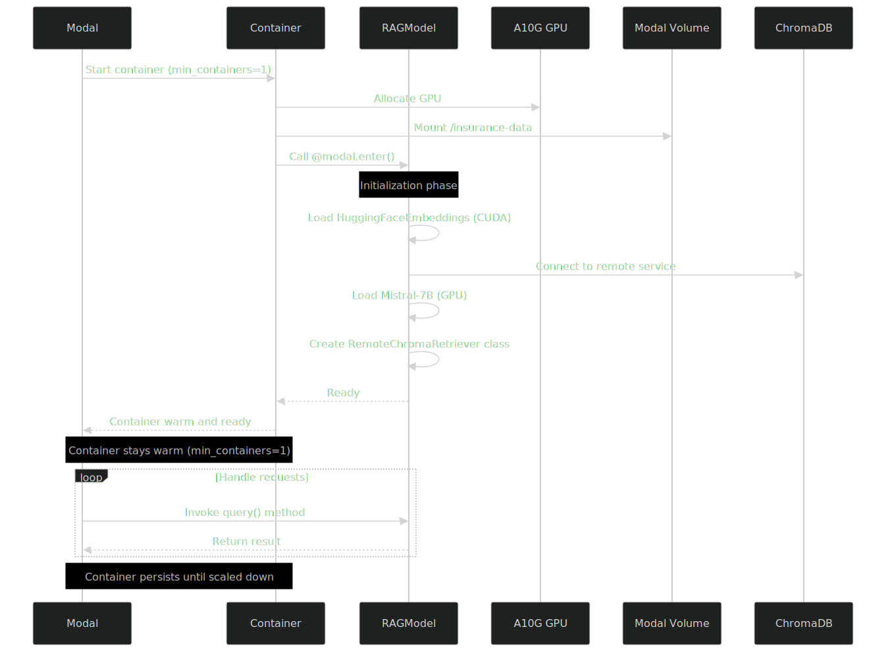

# Modal RAG System - Architecture Diagrams

This directory contains sequence diagrams for the Modal RAG (Retrieval Augmented Generation) application.

## Diagrams

### 1. Indexing Flow

**File**: `1-indexing-flow.svg`

Shows the complete indexing pipeline:
- PDF loading from Modal Volume
- Document chunking (1000 chars, 200 overlap)
- GPU-accelerated embedding generation
- Storage in remote ChromaDB

---

### 2. Query Flow

**File**: `2-query-flow.svg`

Main RAG query pipeline showing:
- Container initialization (`@modal.enter()`)
- Query embedding generation
- Document retrieval (top-k=3)
- LLM answer generation with context
- Response formatting

---

### 3. Web Endpoint Flow

**File**: `3-web-endpoint-flow.svg`

HTTP request handling:
- FastAPI endpoint routing
- Query processing
- JSON response generation

---

### 4. Container Lifecycle

**File**: `4-container-lifecycle.svg`

Modal container management:
- GPU allocation (A10G)
- Volume mounting
- Model loading and warm-up
- Request handling loop
- Container persistence (`min_containers=1`)

---

## Technical Details

### Models
- **LLM**: Mistral-7B-Instruct-v0.3 (GPU, float16)
- **Embeddings**: BAAI/bge-small-en-v1.5 (CUDA)

### Infrastructure
- **GPU**: A10G
- **Autoscaling**: `min_containers=1`, `max_containers=1`
- **Volume**: `mcp-hack-ins-products` at `/insurance-data`
- **Vector DB**: Remote ChromaDB (`chroma-server-v2`)

### Endpoints
- **Local**: `list`, `index`, `query`
- **Web**: `RAGModel.web_query` (FastAPI GET)

---

## Source Files

- Mermaid source: `*.mmd` files
- SVG output: `*.svg` files
- Generated with: `@mermaid-js/mermaid-cli`
