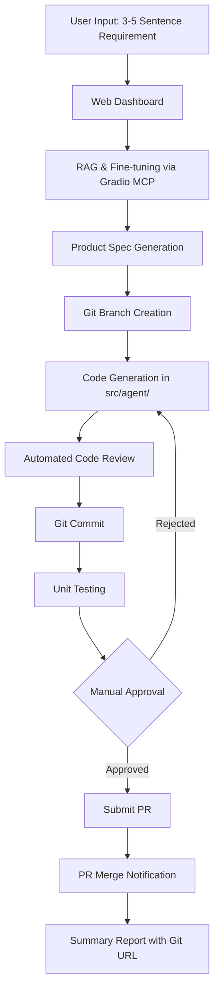

# AI Agent Design: Automated Software Development Workflow

## Overview

This document outlines the design for an AI-powered agent that automates the complete software development lifecycle from requirement gathering to code deployment. The agent integrates with multiple systems (RAG, JIRA, Git, Testing) to provide an end-to-end automated development experience.

---

## System Architecture



---

## Workflow Steps

### 1. Requirement Input & Dashboard
**Input**: User provides 3-5 sentence requirement via web interface

**Components**:
- Web-based dashboard displaying:
  - Current activity status
  - Progress bar for each step
  - Real-time logs
  - File modification tracker
- Built with modern web framework (React/Next.js or Gradio)

**Output**: Structured requirement text

---

### 2. RAG & Fine-tuning System Integration via Gradio MCP
**Process**:
1. Query RAG system with user requirement via Gradio MCP
2. If needed, query fine-tuned model for domain-specific insights
3. Generate detailed product specification including:
   - Feature description
   - Acceptance criteria
   - Technical requirements
   - Dependencies
   - Implementation approach
4. Use **Gradio MCP Server** to access both:
   - RAG system (vector database + LLM)
   - Fine-tuned models (for specialized knowledge)

**Technologies**:
- RAG: Modal + ChromaDB (Remote) + LLM
- Fine-tuned Models: Domain-specific models hosted on Modal
- Gradio MCP Server: Unified interface calling remote Modal endpoints
- LangChain: For orchestrating RAG queries

**Output**: 
- Detailed product specification document
- Technical implementation plan
- Recommended architecture
- Code generation prompts

---

### 3. Git Branch Creation & Code Generation
**Process**:
1. Create feature branch: `feature/JIRA-{epic-id}-{description}`
2. Create directory structure: `src/agent/{feature-name}/`
3. Generate initial code files based on user stories:
   - Implementation files
   - Test files
   - Configuration files
   - Documentation

**Technologies**:
- Git CLI / GitPython
- Code generation: LLM-based (GPT-4/Claude)

**Output**:
- New Git branch
- Initial code structure in `src/agent/`

---

### 4. Automated Code Review
**Process**:
1. Run static analysis tools:
   - Linters (ESLint, Pylint, etc.)
   - Type checkers (TypeScript, mypy)
   - Security scanners (Bandit, Snyk)
2. LLM-based code review:
   - Code quality assessment
   - Best practices validation
   - Architecture review
   - Documentation completeness
3. Generate review report with:
   - Issues found
   - Suggestions for improvement
   - Severity ratings

**Technologies**:
- Static analysis: Language-specific tools
- LLM: GPT-4/Claude for semantic review
- Code review frameworks

**Output**:
- Code review report
- List of issues to fix
- Auto-fix suggestions

---

### 5. Git Commit
**Process**:
1. Stage all modified files
2. Generate meaningful commit message:
   - Format: `feat(JIRA-{id}): {description}`
   - Include:
     - What changed
     - Why it changed
     - Related JIRA ticket
3. Commit to feature branch
4. Push to remote repository

**Technologies**:
- Git CLI / GitPython
- Conventional Commits standard

**Output**:
- Commit SHA
- List of files committed

---

### 6. Unit Testing & Summary
**Process**:
1. Auto-generate unit tests if not present
2. Run test suite:
   - Unit tests
   - Integration tests (if applicable)
   - Coverage analysis
3. Generate test summary report:
   - Total tests run
   - Pass/Fail count
   - Code coverage percentage
   - Failed test details
   - Performance metrics

**Technologies**:
- Testing frameworks: pytest, Jest, JUnit
- Coverage tools: coverage.py, Istanbul
- Test generation: LLM-based

**Output**:
- Test summary report (JSON/HTML)
- Coverage report
- Pass/Fail status

---

### 7. Manual Approval & PR Submission
**Process**:
1. Display test results to user via dashboard
2. Wait for manual approval:
   - Approve: Proceed to PR
   - Reject: Return to code generation (Step 3)
3. If approved:
   - Create Pull Request with:
     - Title: JIRA ticket reference
     - Description: Auto-generated from commits
     - Reviewers: Auto-assigned
     - Labels: Auto-tagged
   - Link PR to JIRA ticket

**Technologies**:
- GitHub/GitLab/Bitbucket API
- JIRA API (via Gradio MCP)
- Web dashboard for approval UI

**Output**:
- PR URL
- PR number
- Approval timestamp

---

### 8. PR Merge Notification & Summary
**Process**:
1. Monitor PR status (webhook or polling)
2. Once merged:
   - Send notification to user
   - Update JIRA ticket status
   - Generate final summary report:
     - Git repository URL
     - Branch name
     - Commit SHAs
     - List of all modified files
     - Test results
     - Code review summary
     - PR link
     - Merge timestamp

**Technologies**:
- Git webhooks
- Notification system (email, Slack, dashboard)
- JIRA API

**Output**:
- Completion notification
- Git URL: `https://github.com/{org}/{repo}/tree/{branch}`
- Modified files list with diff stats
- Full workflow summary

---

## Technology Stack

### Core Components
| Component | Technology |
|-----------|-----------|
| Web Dashboard | HTML/CSS/JS (implemented) |
| Backend API | FastAPI (implemented) |
| RAG System | LangChain + ChromaDB/Pinecone |
| Fine-tuned Models | Domain-specific models |
| LLM | GPT-4 / Claude 3.5 |
| MCP Server | Gradio MCP for RAG & Fine-tuning |
| Git Integration | GitPython |
| Testing | pytest / Jest |
| CI/CD | GitHub Actions / GitLab CI |

### External Integrations
- **RAG System**: Via Gradio MCP Server for knowledge retrieval
- **Fine-tuned Models**: Via Gradio MCP Server for specialized insights
- **Git**: GitHub/GitLab/Bitbucket API
- **Notification**: Email/Slack/Discord

---

## Data Flow

```
User Input (Text)
    ↓
RAG Query (Embeddings) via Gradio MCP
    ↓
Fine-tuned Model Query (if needed)
    ↓
Product Spec (Structured JSON)
    ↓
Implementation Plan Generation
    ↓
Code Generation (LLM)
    ↓
Git Operations (Branch, Commit, Push)
    ↓
Code Review (Static + LLM)
    ↓
Testing (pytest/Jest)
    ↓
Manual Approval (Dashboard)
    ↓
PR Creation (Git API)
    ↓
Merge Notification (Webhook)
    ↓
Summary Report (Dashboard + Email)
```

---

## Dashboard UI Components

### Main Dashboard
```
┌─────────────────────────────────────────────────────┐
│  AI Development Agent - Workflow Status             │
├─────────────────────────────────────────────────────┤
│                                                     │
│  [Input Requirement]                                │
│  ┌───────────────────────────────────────────────┐ │
│  │ Enter your requirement (3-5 sentences)...     │ │
│  └───────────────────────────────────────────────┘ │
│  [Submit]                                           │
│                                                     │
│  Workflow Progress:                                 │
│  ━━━━━━━━━━━━━━━━━━━━━━━━━━━━━━━━━━━━━━━━━━━━━━━ │
│  1. ✅ Requirement Analysis          [Complete]    │
│  2. ✅ RAG & Fine-tuning Query       [Spec Ready]  │
│  3. ✅ Git Branch Created            [feature/...] │
│  4. 🔄 Code Generation               [In Progress] │
│  5. ⏳ Code Review                   [Pending]     │
│  6. ⏳ Git Commit                    [Pending]     │
│  7. ⏳ Unit Testing                  [Pending]     │
│  8. ⏳ Manual Approval               [Pending]     │
│  9. ⏳ PR Submission                 [Pending]     │
│  10.⏳ PR Merge & Notification       [Pending]     │
│                                                     │
│  Activity Log:                                      │
│  ┌───────────────────────────────────────────────┐ │
│  │ [12:34:56] Starting code generation...        │ │
│  │ [12:35:12] Created src/agent/feature/main.py │ │
│  │ [12:35:45] Generated 5 files                 │ │
│  └───────────────────────────────────────────────┘ │
│                                                     │
│  Modified Files: [View Details]                     │
│                                                     │
└─────────────────────────────────────────────────────┘
```

---

## Configuration

### Environment Variables
```bash
# Gradio MCP Server (for RAG & Fine-tuning)
GRADIO_MCP_SERVER_URL=http://localhost:7860

# RAG System
RAG_ENABLED=true
RAG_API_URL=https://your-modal-rag-url.modal.run

# Fine-tuned Models
FINETUNED_MODEL_API_URL=https://your-modal-finetuned-url.modal.run
FINETUNED_MODEL_TYPE=insurance

# Git
GIT_REPO_URL=https://github.com/org/repo
GIT_TOKEN=ghp_xxxxx
GIT_DEFAULT_BRANCH=main

# Testing
TEST_FRAMEWORK=pytest
COVERAGE_THRESHOLD=80

# Notifications
SLACK_WEBHOOK_URL=https://hooks.slack.com/xxxxx
EMAIL_SMTP_SERVER=smtp.gmail.com
```

---

## Error Handling

### Retry Logic
- **RAG Query Failure**: Retry 3 times with exponential backoff
- **JIRA API Failure**: Retry 3 times, fallback to manual creation
- **Git Operations**: Retry 2 times, alert user on failure
- **Test Failures**: Allow manual intervention or auto-fix

### Rollback Strategy
- **Code Review Failure**: Revert to previous commit
- **Test Failure**: Option to fix or abandon
- **PR Rejection**: Keep branch for manual fixes

---

## Security Considerations

1. **API Keys**: Store in secure vault (AWS Secrets Manager, HashiCorp Vault)
2. **Code Scanning**: Run security scans before commit
3. **Access Control**: RBAC for dashboard and Git operations
4. **Audit Logging**: Log all actions with timestamps
5. **Code Isolation**: Run code generation in sandboxed environment

---

## Future Enhancements

1. **Multi-language Support**: Extend beyond Python/JavaScript
2. **AI Code Reviewer**: More sophisticated LLM-based reviews
3. **Auto-deployment**: Deploy to staging after PR merge
4. **Performance Testing**: Add load/performance tests
5. **Documentation Generation**: Auto-generate API docs
6. **Slack/Teams Integration**: Real-time notifications
7. **Analytics Dashboard**: Track metrics (velocity, quality, etc.)

---

## Success Metrics

- **Automation Rate**: % of steps completed without human intervention
- **Time to PR**: Average time from requirement to PR submission
- **Code Quality**: Pass rate of code reviews
- **Test Coverage**: Average coverage across projects
- **User Satisfaction**: Feedback scores from developers

---

## Conclusion

This AI agent design provides a comprehensive, automated software development workflow that reduces manual effort, improves code quality, and accelerates delivery. By integrating RAG, JIRA (via Gradio MCP), Git, and testing tools, the system creates a seamless experience from requirement to deployment.
