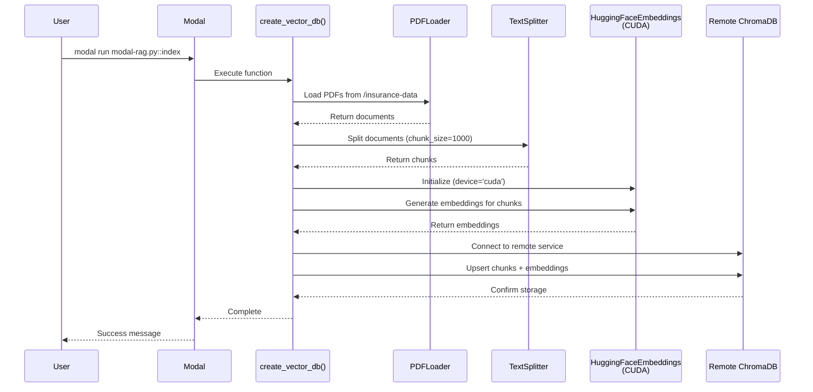
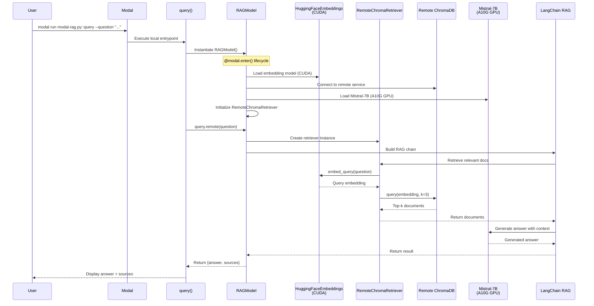
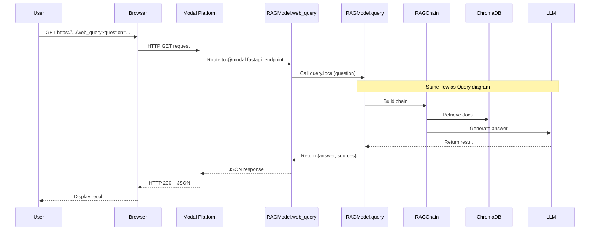
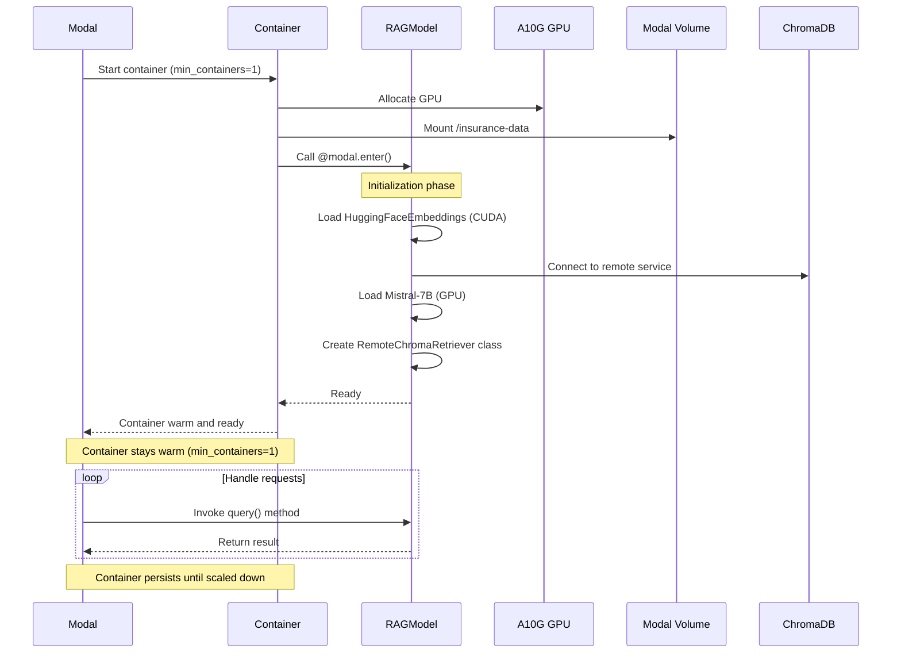

# Modal RAG System - Sequence Diagrams

This document provides sequence diagrams for the Modal RAG (Retrieval Augmented Generation) application.

## 1. Indexing Flow (create_vector_db)

## 2. Query Flow (RAGModel.query)

## 3. Web Endpoint Flow (RAGModel.web_query)

## 4. Container Lifecycle (RAGModel)

## Key Components

### Modal Configuration
- **App Name**: `insurance-rag`
- **Volume**: `mcp-hack-ins-products` mounted at `/insurance-data`
- **GPU**: A10G for RAGModel class
- **Autoscaling**: `min_containers=1`, `max_containers=1` (always warm)

### Models
- **LLM**: `mistralai/Mistral-7B-Instruct-v0.3` (GPU, float16)
- **Embeddings**: `BAAI/bge-small-en-v1.5` (GPU, CUDA)

### Storage
- **Vector DB**: Remote ChromaDB service (`chroma-server-v2`)
- **Collection**: `insurance_products`
- **Chunk Size**: 1000 characters with 200 overlap

### Endpoints
- **Local Entrypoints**: `list`, `index`, `query`
- **Web Endpoint**: `RAGModel.web_query` (FastAPI GET endpoint)
