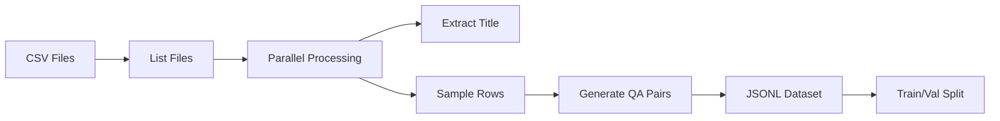

# Dataset Generation

Converting CSV files into Question-Answer pairs for fine-tuning.

## Overview

Raw CSV files are not suitable for fine-tuning. We transform tabular data into natural language QA pairs that teach the model to answer statistical questions.

## Script: `docs/prepare_finetune_data.py`

### Usage

```bash
modal run docs/prepare_finetune_data.py
```

### Process Flow



### Data Transformation

#### Input: CSV File
```csv
Prefecture,Population,Households,Area_km2
Tokyo,14047594,7421340,2194
Osaka,8837685,4208397,1905
```

#### Output: QA Pairs
```json
{
  "instruction": "What is the Population for Tokyo in the dataset '2020 Population Census'?",
  "input": "Context: Japan Census data.",
  "output": "According to the '2020 Population Census' dataset, the Population for Tokyo is 14047594."
}
```

### Configuration

**Sampling Strategy:**
- **Use ALL rows** from every CSV file (no limit)
- Ensures maximum data coverage
- Generates 2-3 million QA pairs from 6,888 files

**QA Generation:**
- For each row in the CSV:
  - Pick random column (value column, not label)
  - Create question about that specific value
  - Generate answer with context

### Output Format

**Alpaca Format:**
```json
{
  "instruction": "Question text",
  "input": "Context information",
  "output": "Answer text"
}
```

This format is compatible with:
- Unsloth's `SFTTrainer`
- HuggingFace's `transformers`
- Most fine-tuning frameworks

### Results

**Dataset Statistics:**
```
Total data points: 2-3 million
Train set: ~2.7M (90%)
Validation set: ~300K (10%)
```

**Files Created:**
- `/data/dataset/train.jsonl` (~2-4GB)
- `/data/dataset/val.jsonl` (~200-400MB)

### Performance

- **Runtime**: ~10-15 minutes
- **Parallel Workers**: 100 containers
- **Processing Rate**: ~700 files/minute

## Data Quality

### Title Extraction

The script extracts human-readable titles from CSV metadata:

```python
# Filename: 00200521_2020_Population_Census.csv
# Extracted title: "2020 Population Census"
```

### Value Filtering

Skips invalid values:
- `NaN`
- Empty strings
- `-` (missing data marker)
- `None`

### Example QA Pairs

**Census Data:**
```json
{
  "instruction": "What is the number of households for Hokkaido?",
  "input": "Context: Japan Census data.",
  "output": "According to the '2020 Census Households' dataset, the number of households for Hokkaido is 2,720,000."
}
```

**Economy Data:**
```json
{
  "instruction": "What is the average income in Osaka?",
  "input": "Context: Japan Economy & Labor data.",
  "output": "According to the 'National Survey of Family Income' dataset, the average income in Osaka is 5,200,000."
}
```

## Customization

### Adjust Sampling Rate

Edit `docs/prepare_finetune_data.py`:

```python
@app.function(...)
def generate_dataset(sample_rows_per_file: int = 50):  # Change this
```

**Trade-offs:**
- More samples = better coverage, larger dataset, longer training
- Fewer samples = faster, smaller dataset, less diversity

### Change Train/Val Split

```python
split_idx = int(len(data_points) * 0.9)  # 90/10 split
```

### Modify QA Template

```python
question = f"What is the {col} for {row_label} in the dataset '{title}'?"
answer = f"According to the '{title}' dataset, the {col} for {row_label} is {val}."
```

## Validation

### Check Dataset Quality

```bash
# View first few examples
head -n 3 /data/dataset/train.jsonl
```

### Verify Format

```python
import json

with open('train.jsonl') as f:
    for line in f:
        data = json.loads(line)
        assert 'instruction' in data
        assert 'input' in data
        assert 'output' in data
```

## Troubleshooting

### Issue: Empty Dataset
**Cause**: No valid CSV files found
**Solution**: Check volume mounting and file paths

### Issue: Low Data Count
**Cause**: Many CSVs have invalid data
**Solution**: Increase `sample_rows_per_file` or check CSV quality

### Issue: Memory Error
**Cause**: Too many data points loaded at once
**Solution**: Process in batches or reduce sampling

## Next Steps

With the dataset ready, proceed to [Model Training](03-model-training.md) to fine-tune Phi-3.
